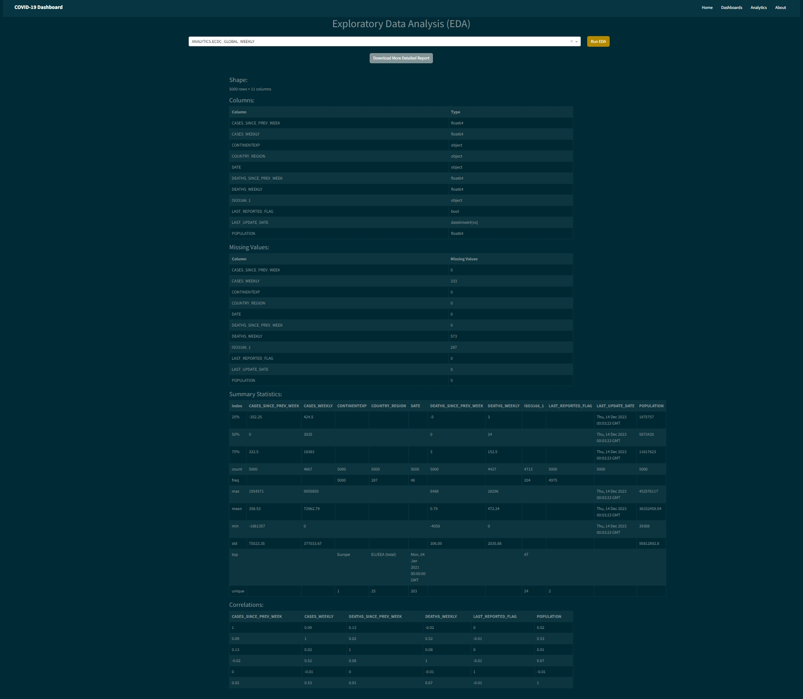
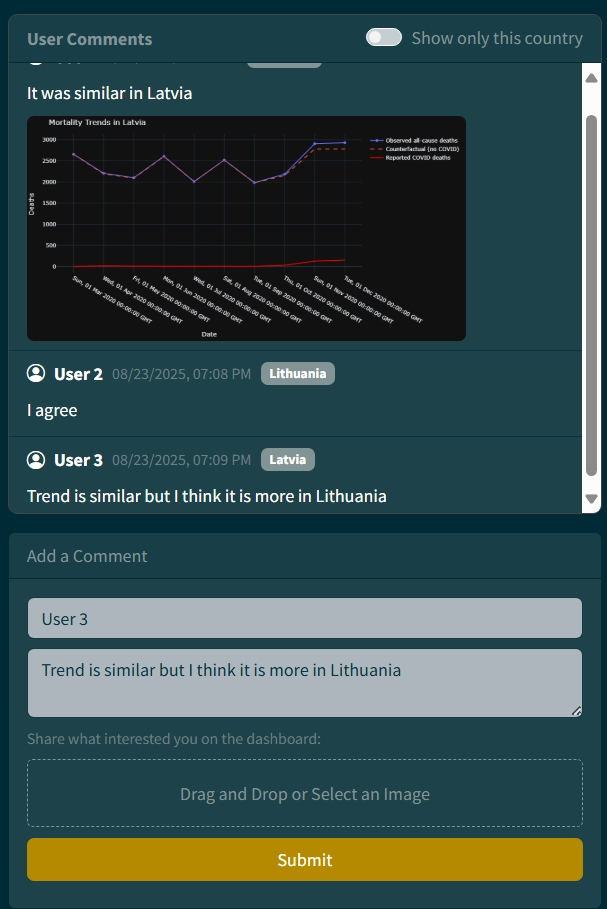
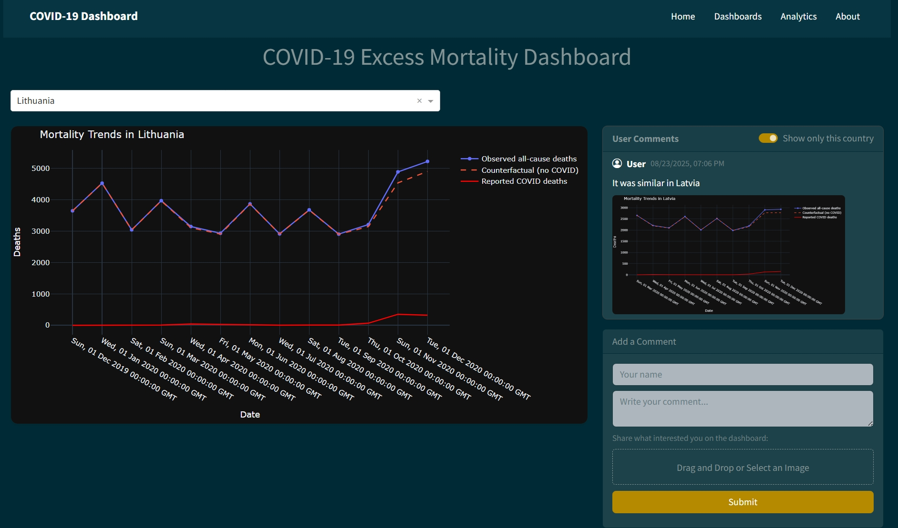
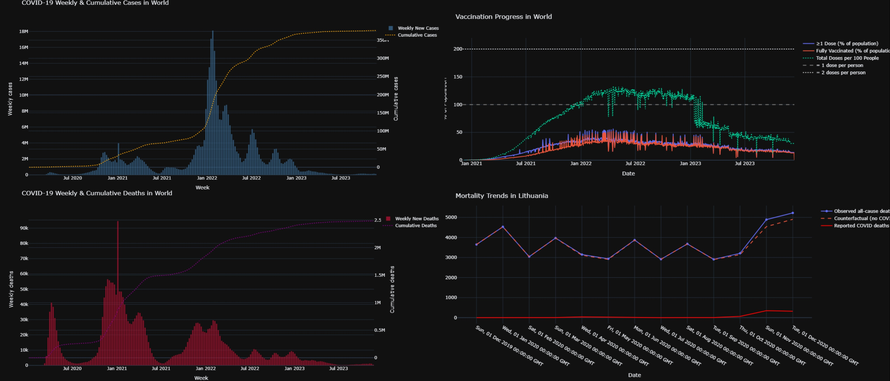
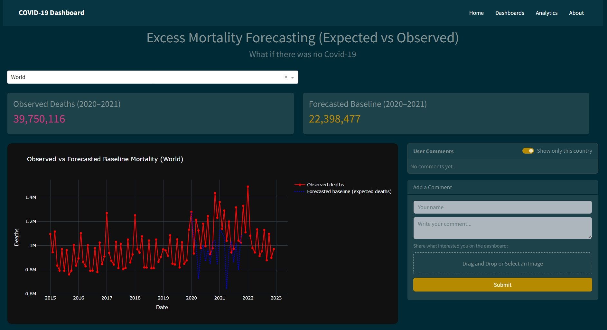
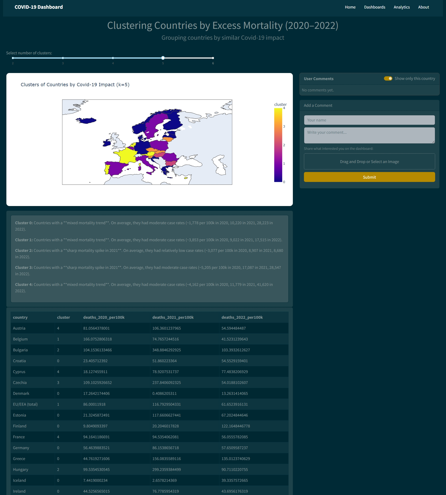
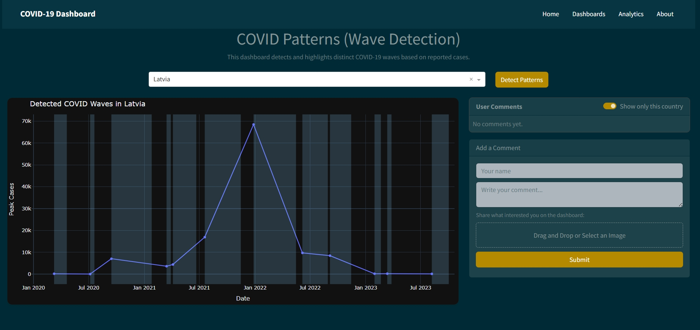

# COVID-19 Data Integration, Analysis, and Visualization Platform

**Author: Giga Shubitidze**  
Bootcamp Project Report

This project implements an end-to-end analytics platform for COVID-19 data, combining **Snowflake**, **Python**, **MongoDB**, and **Dash/Plotly**. The goal is to integrate structured and semi-structured data, build an API layer, and deliver interactive dashboards for analysis of COVID-19’s global impact.

---

## Features

- **Data Integration**
  - Snowflake Marketplace COVID-19 epidemiological datasets
  - Kaggle World Mortality dataset (for excess mortality analysis)

- **Dashboards**
  - Mortality vs. reported COVID deaths
  - Infection cases & deaths trends
  - Vaccination progress
  - Excess mortality forecasting (Prophet)
  - Country clustering by pandemic dynamics (KMeans)
  - Exploratory Data Analysis (EDA) with summary stats & correlations
  - Pattern recognition (Snowflake `MATCH_RECOGNIZE`)

- **User Interaction**
  - Add comments per dashboard (stored in MongoDB with optional image upload via GridFS)
  - Share insights and annotations inside dashboards

- **API**
  - REST endpoints for all datasets
  - Automated EDA reports (HTML via `ydata-profiling`)
  - Query caching for performance

- **Deployment**
  - Fully containerized with Docker Compose
  - Works on any VM or cloud environment (just make sure ports are free)
  - NoSQL database (MongoDB) used for user-generated content

---

## Project Structure

```

.
├── api/                     # Flask API service
│   └── src/
│       ├── api.py           # API entrypoint
│       ├── sql/setup.sql    # Snowflake setup SQL script
│       ├── sql/setup.py     # Snowflake setup runner
│       ├── forecast.py      # Forecasting logic (Prophet)
│       ├── clustering.py    # Clustering logic (KMeans)
│       ├── eda.py           # EDA functions (ydata-profiling)
│       └── Dockerfile
│
├── dash/                    # Dash dashboard service
│   └── src/
│       ├── app.py           # Dash entrypoint
│       ├── components/      # Navbar, comments component
│       ├── pages/           # Individual dashboards
│       └── Dockerfile
│
├── shared/                  # Shared code for API & Dash
│   ├── config/              # Environment variables & constants
│   └── utils.py             # Snowflake queries, preprocessing
│
├── docker-compose.yml        # Compose file for API + Dash + Mongo
├── requirements.txt          # Dependencies
└── README.md                 # This report

````

---

## Setup & Deployment

### 1. Clone and Configure
```bash
git clone https://github.com/bokuwagiga/covid19-analytics-platform.git
cd covid19-analytics-platform
````

Copy environment template example.env to .env and fill in your credentials:

```bash
cp shared/config/example.env shared/config/.env
```

Fill in:

* Snowflake account, user, password, warehouse, database, schema
* MongoDB URI (local, Docker, or Atlas)

### 2. Option A – Run with Docker (recommended)

```bash
docker compose up --build
```

* API → [http://localhost:5000](http://localhost:5000)
* Dashboard → [http://localhost:8050](http://localhost:8050)
* MongoDB → [http://localhost:27017](http://localhost:27017) (if needed)

*(Ensure ports 5000, 8050, and 27017 are free.)*

### 3. Option B – Run Locally (without Docker)

```bash
python -m venv .venv
source .venv/bin/activate   # (Unix/Mac)
# .venv\Scripts\activate   # (Windows)

pip install -r requirements.txt
python api/src/api.py
python dash/src/app.py
```

---

## API Endpoints

* `/countries` → list countries
* `/comments [GET|POST]` → comments CRUD (stored in MongoDB + GridFS images)
* `/comments/image/<id>` → fetch uploaded image
* `/excess-mortality` → merged mortality vs. COVID deaths
* `/vaccinations` → vaccination progress
* `/infection-cases` → infection case trends
* `/infection-deaths` → infection death trends
* `/mortality-forecast` → forecast with Prophet
* `/clustering` → clustering of countries
* `/eda` → basic EDA on a Snowflake table
* `/eda/report` → detailed profiling HTML report
* `/eda/tables` → list available Snowflake tables
* `/patterns` → COVID wave detection with `MATCH_RECOGNIZE`

*(Frequently accessed endpoints cached for 5 minutes.)*

---

## Task Implementation Report

### Step 1 – Snowflake Setup

* Subscribed to *COVID-19 Epidemiological Data* (Starschema) from Snowflake Marketplace.
* Created **warehouse, DB, schema** using `setup.sql`.
* Configured **resource monitors** to prevent credit overuse.

### Step 2 – Data Exploration and Enhancement

* Used SQL to explore the datasets.
* Integrated Kaggle **World Mortality dataset** to measure excess mortality.
* Automated EDA with `/eda` endpoint and `ydata-profiling`.



### Step 3 – NoSQL Schema

User comments stored in MongoDB with this schema:

```json
{
  "comment": "Example insight",
  "country": "Lithuania",
  "user": "user1",
  "page": "cases",
  "created_at": "2025-08-22T19:33:45Z",
  "image_id": "68a8c61...",
  "image_url": "/comments/image/68a8c61..."
}
```



### Step 4 – API Development

* Flask API with endpoints for all COVID datasets, comments, EDA, clustering, forecast, and patterns.
* Implemented caching (`Flask-Caching`).
* Supports both JSON + file uploads (GridFS for images).

### Step 5 – Visualization

* Dash dashboards for: Mortality, Vaccination, Infection cases, Infection deaths, Forecasting, Clustering, Patterns.
* Modular UI with reusable `CommentsSection`.



### Step 6 – Analytical Features

* **Forecasting**: Prophet model for mortality baseline vs. observed.
* **Clustering**: KMeans grouping of countries by impact.
* **Pattern recognition**: Snowflake `MATCH_RECOGNIZE` to identify COVID waves.
* **EDA**: Summary stats, correlations, missing values.






### Step 7 – Performance Optimization

* Resource monitors in Snowflake.
* Limited rows for EDA (`LIMIT 5000`).
* Cached expensive API calls.

### Step 8 – API Caching

* Implemented caching for `/countries`, `/comments`, `/eda/tables`, and EDA endpoints.

### Step 9 – Pattern Detection

* Implemented SQL pattern recognition:

  * Detects `rise → peak → fall` sequences in weekly cases.



### Step 10 – Project Sharing

* Provided `setup.sql` for Snowflake schema creation.
* Dockerized project to ensure portability on any VM.

---


## Dependencies

* **Data & DB**: `snowflake-connector-python`, `pymongo`, `gridfs`
* **Processing**: `pandas`, `numpy`, `prophet`, `scikit-learn`
* **Visualization**: `plotly`, `matplotlib`, `dash`, `dash-bootstrap-components`
* **Web & API**: `flask`, `flask-caching`
* **Utilities**: `python-dotenv`, `kagglehub`
* **EDA**: `ydata-profiling`

---

## Author

**Giga Shubitidze**